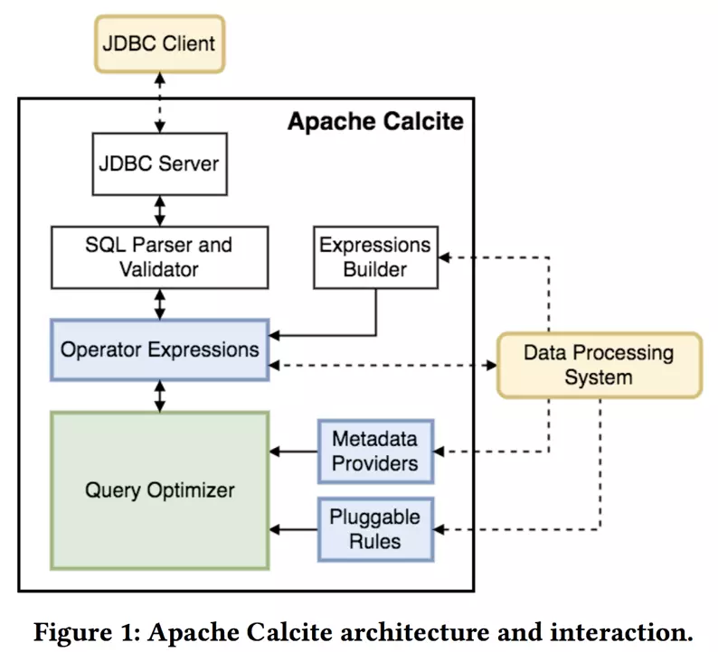
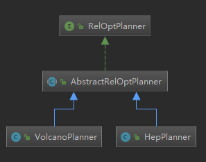

SQL Optimize优化

# 查询优化器简介

数据库的三大核心部分，包括SQL解析优化、执行引擎、存储引擎。查询优化器就是SQL解析优化的一部分。一条SQL进入数据库系统后，首先需要通过解析器进行解析，生成相应的关系表达式，然后再经过优化器优化生成物理执行计划，最后执行引擎从存储中读取数据，执行优化的物理计划。优化器是数据库的重要组成部分，是数据库中用于把关系表达式转换成执行计划的核心组件，不考虑硬件本身的差异 ，优化器在很大程度上决定了一个系统的性能。

## 查询优化器的分类

根据优化方法的不同，查询优化器主要分为两类：基于规则的优化器（Rule Based Optimizer，简称RBO）和基于代价的优化器(Cost Based Optimizer，简称CBO)

- **基于规则的优化器**

  根据优化规则将一个关系表达式转换成另外一个关系表达式，同时原有表达式被放弃，经过一系列转换生成最终执行计划。事实上，RBO是一种比较落后的优化器，它只认规则，对数据不敏感；容易陷入局部优但是全局差的场景；同时受规则顺序影响而产生不同执行计划

- **基于代价的优化器**

  根据优化规则对关系表达式进行转换，同时原有表达式也会保留，经过一系列转换后会生成多个执行计划，之后计算每个执行计划的Cost，从中挑选Cost最小的执行计划作为最终执行计划。CBO的优点是灵活智能，它能根据数据的特点生成相应的执行计划。因此，目前各大数据库和计算引擎都倾向于使用CBO，例如从Oracle 10g开始，Oracle已经彻底放弃RBO，转而使用CBO，而Hive在0.14版本中也引入了CBO。

**基于代价的优化器的两种不同风格**

CBO主要有两种不同风格的框架，一种是System-R风格，另一种是Volcano/Cascade风格。

-  **System-R**

  Sql statement经过Parser和Resolver后，首先进行查询改写，再通过优化器通过动态规划算法生成最后的物理执行计划，最后交由执行器执行。这种风格的CBO最早由IBM的数据库使用，之后被Oracle和PostgreSQL使用。

- **Volcano/Cascade**

  Volcano/Cascade与System-R 的不同点在于，前者的物理优化器是Top-down，而后者是Bottom-up。Volcano/Cascade基于一定的规则体系（逻辑规则+物理规则）来生成比较好的物理执行计划。这种风格目前被SQL Server、Apache Calcite和Pivotal所使用。

## Apache Calcite

Apache Calcite是一个独立于存储和执行的SQL优化引擎，在开源的大数据计算引擎中广泛使用，例如Flink、Hive、Drill、Kylin等。

​		Calcite的目标是“一种方案适用于所有需求场景”，旨在为不同的计算平台和数据源提供统一的查询引擎。如上图所示，Calcite的架构不包括存储和执行。整体流程是一个SQL statement通过JDBC Client进入JDBC Server后，经过SQL Parser 和Validator后生成关系代数表达式（Operator Expressions）。除此之外，用户还可以使用Expressions Builder生成SQL的关系代数表达式，这适用于有自己特定语法的系统。生成的关系代数表达式会进入查询优化器核心引擎（Query Optimizer），负责执行动态规划算法和Cost计算。Calcite还提供一些可插拔的功能，如Metadata Providers（为优化引擎提供Metadata）和Pluggable Rules（支持用户自定义优化规则）。

## Apache Calcite优化器实现

Calcite 主要提供了两种优化器的实现:

- **HepPlanner**

  基于代价的优化器RBO的实现，HepPlanner是一个启发式的优化器，按照规则进行匹配，直到达到次数限制（预先设置的match次数限制）或者遍历一遍后不再出现 rule match的情况才算完成；

- **VolcanoPlanner**

  基于代价CBO 的实现，它会一直迭代 rules，直到找到 cost 最小的计划。

# SQL优化

## 查询优化器执行

无论是RBO，还是CBO都包含了一系列优化规则，这些优化规则可以对关系表达式进行等价转换，常见的优化规则包含：

- 谓词下推
- 列裁剪
- 常量折叠
- 其他

### 查询优化器的执行过程

**RBO**

RBO的执行过程比较简单，主要包含两个步骤：

**1）Transformation**

遍历关系表达式，只要模式能够满足特定优化规则就进行转换。

**2）Build Physical Plan**

经过Step1之后就生成了一个逻辑执行计划，但这只是逻辑上可行，还需要将逻辑执行计划build成物理执行计划，即决定各个Operator的具体实现。如Join算子的具体实现选择BroadcastHashJoin还是SortMergeJoin。

**CBO**

CBO查询优化主要包含三个步骤：

**1）Exploration**

根据优化规则进行等价转换，生成等价关系表达式，此时原有关系表达式会被保留。

**2）Build Physical Plan**

决定各个Operator的具体实现。

**3）Find Best Plan**

根据统计信息计算各个执行计划的Cost，选择Cost最小的执行计划。

#  Dataflow优化

Dataflow与一般的SQL不同，一般的SQL语句只有单向收敛DAG，即数据不会出现新的分支，不能输出到多张表。而Dataflow不同，会出现新的分支，可能会在某一个节点进行Split，Split导致不同的数据处理分支，输出到不同的数据源。Dataflow基本上类似于多条SQL语句的合体，多条语句与单一SQL语句的优化策略上稍有不同。

多条SQL语句如果有相同的部分可以进行重用以提交效率高，叫做Subplan重用。

在Flink这样的执行引擎中，一般使用DataStream API来实现多条SQL语句才能实现的功能，但是有了Subplan重用机制后，可以使用将多条SQL在一个Job中执行，Flink会自动进行Subplan的重用。

# 分布式优化

单机SQL优化，一般只考虑CPU、磁盘IO、表的统计信息就够了，分布式计算优化的时候，需要考虑网络的代价，这是与单机SQL优化不同的地方。

# 物理优化

SQL层面的优化不涉及物理执行的优化，执行层面的优化由各个不同的分布式计算引擎来完成。

# 附录

## 论文

- [1] [The Volcano Optimizer Generator: Extensibility and Efficient Search](https://www.seas.upenn.edu/~zives/03s/cis650/P209.PDF)

- [2] [The Cascades Framework for Query Optimization](https://pdfs.semanticscholar.org/c1a3/9da04a072f695e9a7f36bf397fba5c19b93c.pdf)

- [3] [Orca: A Modular Query Optimizer Architecture for Big Data](https://15721.courses.cs.cmu.edu/spring2017/papers/15-optimizer2/p337-soliman.pdf)

