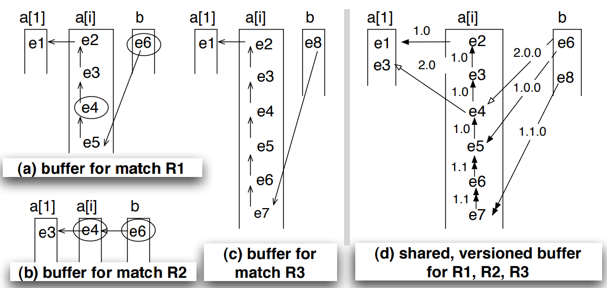

<font size="20">基于事件流的高效模式匹配</font>

Flink的CEP实现重度参考了论文《[Efficient Pattern Matching over Event Streams](https://people.cs.umass.edu/~immerman/pub/sase+sigmod08.pdf)》，此文是该论文核心部分的中文版。

**下边是论文的正文部分**

事件流上的模式匹配应用领域越来越广泛，例如金融服务，基于RFID的库存管理，点击流分析和电子健康医疗等。

正则表达式是模式匹配的一种应用，相比正则表达式比配，流上的匹配面临两个新的挑战：

1. 流上的模式匹配语言，必须能够表达比正则更丰富的语义。
2.  流上的模式匹配（流查询）需要新的算法和优化规则：传统的流上查询处理的优化规则不够了。

在本文中，提出了一个评估模型和查询优化框架，能够精确的表达流上的模式匹配的语义，并提供优化的原则。使用此模型进一步分析运行时的复杂度，并提出了一种共享存储和计算的方法，来提高运行时效率。实验结果表明，使用这个方法，模式匹配的性能获得了很大的提升。

# 简介

事件流上的模式匹配是一种新的处理范例，其中连续到达的事件与复杂模式匹配，并且用于匹配每个模式的事件被转换为用于输出的新事件。 最近，由于其在金融服务[10]、基于RFID的库存管理[31]、点击流分析 和电子健康系统等领域的广泛适用性，对流的模式匹配引起了业界的极大兴趣。。 例如，在金融服务中，经纪人可能对代表新市场趋势的一系列股票交易事件感兴趣。 在基于RFID的跟踪和监控中，应用程序可能希望跟踪有效的货运路径并检测供应链中的食品污染等异常情况。

正则表达式匹配的研究已经非常成熟了，而流的模式匹配与正则相比有两个新的挑战：

1. 更丰富的表达式语言
2. 高效的流处理

## **流上模式匹配查询示例**

**(a) Query 1**

```sql

PATTERN SEQ(Shelf a, ∼(Register b), Exit c)
WHERE    skip_till_next_match(a, b, c) { 
               a.tag_id = b.tag_id 
       and     a.tag_id = c.tag_id 
               /* equivalently, [tag_id] */     } 
WITHIN    12 hours
```

在基于RFID的零售管理中，检测商品被从架子上拿下来，12小时内未付款，被带了出来。上边的Pattern序列中包含了3个子Pattern，商品从货架上拿下的Pattern，接下来在后续中的未注册商品的Pattern，最后是一个带出去的Pattern。**~**符号表示否定判断。

每一个子模式声明了一个对应于事件的变量（三个变量a，b，c）。在where中使用Pattern中定义的变量做判断，在本例中，判断条件是三个子模式的事件有相同的tag_id则视为一次匹配。类似于这样的相等比较，被叫做相等测试。最后，在该模式匹配中使用**WITHIN**关键字给定了时间窗口的限制条件。

**(b) Query 2**

```sql

PATTERN SEQ(Alert a, Shipment+ b[ ])
WHERE    skip_till_any_match(a, b[ ]) {
                 a.type = 'contaminated'   
       and       b[1].from = a.site
       and       b[i].from = b[i-1].to }
WITHIN    3 hours
```

检测供应链中的错乱，首先捕获到一个站点的货物配送错乱的告警，然后跟踪该站点的一系列的受影响的配送。在pattern序列中使用了**+**号匹配一个或者多个后续的受影响的配送。b[]数组表示所有从警告a开始的所有受影响的配送，b[1]表示第一个受影响的配送，b[i]表示受前一个影响的配送。

```java
b[i].from = b[i-1].to
```

上边的断言表示后一个配送来自于前一个配送。

**(c) Query 3**

```sql

PATTERN SEQ(Stock+ a[ ], Stock b)
WHERE    skip_till_next_match(a[ ], b) {
                 [symbol]  
       and       a[1].volume > 1000
       and       a[i].price > avg(a[..i-1].price) 
       and       b.volume < 80%*a[a.LEN].volume } 
WITHIN    1 hour
```

检测复杂的股票市场趋势：在过去一小时中，股价持续走高，然后在接下来的一段事件中，保持相对稳定的变化。该pattern序列中包含两个子pattern：一个股票事件的Kleene闭包 **+**运算，结果保存在a[]数组中，一个单一的股票事件保存在b中。

```sql
a[1].volume > 1000
```

该断言表示一个符合条件的匹配序列的开始。

```sql
a[i].price > avg(a[..i-1].price) 
```

该断言要求后续的a事件是持续增长趋势的，对于当前事件a[i]要大于过去所有符合匹配条件的a[1] ...a[i-1]事件的平均值。这样就可以捕获一个持续增长的趋势（不是单调递增，总体趋势增长即可）。

```sql
b.volume < 80%*a[a.LEN].volume
```

该断言比较比较b和a[]中的最后一个事件，当b小于a[a.LEN]股价的80%的则认为是趋势的翻转。

除了定义变量和断言，模式查询还需要**事件选择策略**，用来在混杂的事件输入流中（相关和不相关的事件混杂在一起）选择事件。

## **事件选择策略**

- **严格相邻 Strict contiguity**

  两个事件必须严格相邻，中间不能有其他事件。

  例如 对于模式 a.next(b)，（a，b）合法，（a，c，b）不合法。

- **分区相邻 Partition contiguity**

  松散的严格相邻，partition可以理解为先group by，group by之后隶属于相同分组的必须严格相邻。在总体上事件流上不是严格相邻。

  例如对于模式 a.next(b)，按照group进行partition。

  （group1，a） (group2, c)  (group1,b) 合法的。

  （group1，a） (group1, c)  (group1,b)非法。

- **跳到下一个匹配 Skip till next match**

  完全不要求连续性（严格相邻和分区相邻），跳过所有不符合模式的事件，直到出现下一个符合模式的事件出现。使用这个策略，在**Query1**中可以忽略所有从货架取货和出门之间的所有不相关事件。在Query3中可以跳过不满足定义的趋势的事件。

  在现实世界里，存在大量的信息噪声，该策略可以忽略这些信息噪声，关注在符合模式的事件上。

- **跳到任何一个匹配 Skip till any match**

  相比**Skip till next match**，该策略更加的宽松，允许在符合模式的事件上有不确定的行为。

  **Query2**中使用了此策略，假设b[]中最有一个地点是X，当符合模式的下一个事件到来时（地点是Y），对于该策略而言有两种行为：

  1. Take事件，将事件添加到b[]中，b[]的最后位置变为Y。
  2. Ignore事件，保存当前的b[]的状态，b[]的最后位置仍然是X，当后续的Z到来时，形成两个不同的匹配事件集合（X -> Y )和（X -> Z)。

  **Skip till any match**本质上是在相关事件集合上计算传递闭包。

## **输出模式**

模式匹配成功之后，需要将匹配的事件输出。一般有两种输出模式：

- 所有匹配事件（默认输出模式）

- 无重复事件

  对于同一个分区，只输出一个匹配事件集合（严格相邻策略，把整个输入事件流当做一个分区）。换个说法，对于同一个分区，只有上一个匹配完成之后，才会启动下一次匹配过程。

对于组合事件和组合查询，只需要将上游的输出当做下游的输入即可。

**三个要点**

# 语义模型

在本章中，介绍可以精确表达流上模式匹配的$NFA^b$ 模型、模式匹配语言的编译算法，生成用在运行时刻的查询计划。

## 评估模型$NFA^b$


图2 **Query3**的$NFA^b$状态机


$NFA^b$模型由一个非确定$NFA$状态机和一个匹配缓冲区组成。

$NFA^b$状态机的数学表达形式如下：

$A$ $=$ $(Q,E,\theta,q_1,F)$

$Q$ 状态的集合

$E$ 边的集合

$\theta$ 边上的条件计算公式

$q_1$起始状态

$F$结束状态

### 状态

在图2（a）中，a[1]是匹配流程的起点。等待输入事件开启闭包的匹配，与a[1]匹配的事件写入匹配缓冲区a[1]对应的存储单元。进入下一个状态a[i]之后，符合匹配的条件写入匹配缓冲区的a[i]（i > 1）对应的存储单元。接下来的状态b，说明闭包比配完毕，准备进入下一个状态的匹配。结束状态$F$表示匹配过程结束，输出匹配的结果。

总而言之，状态集合$Q$被排列为一个线性的序列，序列中包含了任意数量的孤子状态s(非闭包匹配都是孤子状态singleton state)，或者状态对p[1],p[i] (闭包状态)，加上最右边的结束状态。

> 孤子状态类似于p[1]，但是没有后边的p[i]。

### 边

每个状态与一定数量的边相关联，边表示此状态上的行为。

在图2（a）中，每个孤子状态或者状态对中的第一个状态（本例中是p[1])都有一个向前的**begin**边，每一个状态对中的第二个状态（本例中是p[i]都有一个向前的**proceed**边和一个循环的**take**边。除了起始和结束状态，每个孤子状态都有一个循环的**ignore**边。起始状态没有入边。

状态上的每个边，都可以用一个三元组来表示：

- **计算公式**

  计算公式用来计算匹配条件，记做 $\theta_{q_edge}$。计算公式是从模式查询语句编译而来。

- **对输入流的操作**

  是否消费输入的事件

- **对匹配缓冲区的操作**

  是否写入匹配缓冲区

如图2（a）中所示

- 实现表示**begin**和**take**边，消费事件并写入匹配缓冲区。
- 虚线表示**ignore**边，消费输入事件但是不写入匹配缓冲区。
- 带菱形箭头的边是**proceed**边，不消费任何输入事件，根据边上计算公式判断是否推进到下一个状态。

### 非确定性

当一个状态的两个边上的条件不互斥的时候，$NFA^b$状态机会进入不确定状态。例如，如果$\theta_{p[i]\_take}$和$\theta_{p[i]\_ignore}$不互斥，就会进入一个**skip-till-any-match**的状态。这种不确定性$NFA^b$，是从模式查询语句编译而来的，一切取决于模式查询语句如何编写。

### $NFA^b$运行实例

一个$NFA^b$包含匹配缓冲区中的一组匹配事件，每个$NFA^b$实例都有自己的一组唯一的匹配事件。例如对于**Query3**，一个$NFA^b$的实例匹配的事件是$e_3$,$e_4$,和$e_6$，对应的匹配缓冲区的存储单元叫做a[1],a[2]和b。

当$NFA^b$实例到达结束状态的时候，就认为​匹配成功。模式查询就是在流上找到成功的模式匹配事件，并将结果输出。

带有**否定判断**和组合查询的模式匹配查询，首先会对子查询构建$NFA^b$状态机，然后组合而成。（此处比较绕，需要后续研究澄清）。特别是对于嵌套查询的否定语义而言。

举例来说，在**Query1**中，该模式首先识别从货架上取下物品，最后识别带出门外，中间需要确保物品没有付款（这三个模式作用于有相同tag_id的物品上）。为了在$NFA^b$中支持否定语义，首先需要计算肯定语义的模式，然后查找有没有符合否定语义的事件，如果有则匹配失败。（此处的否定语义匹配，是不包含否定符号的，如Query1中，如果存在register事件，则整个匹配失败）。

## 查询编译$NFA^b$

本节介绍将简单模式查询语句（无否定判断和组合）转换为$NFA^b$状态机的规则。否定判断和组合查询的组合状态机，可以通过严格遵循其语义构建。（此处翻译的很拗口，待研究澄清)。编译转换生成的查询计划用作在运行时判断事件流是否满足模式。

### 基本算法

以**Query3**为例逐步介绍该算法的基本步骤：

1. **$NFA^b$结构**

如图2中所示，Pattern子句定义了$NFA^b$状态机的结构，包括所有的状态和状态上的边。

该算法然后将WHERE和WITHIN子句转换为$NFA^b$边上的计算公式。

2. **Predicates断言**

该算法从WHERE子句开始，将WHERE中的断言（逻辑判断条件）变成**begin**、**take**、**proceed**边，如图2（b）所示。

首先将所有的断言转换为[CNF范式](https://baike.baidu.com/item/合取范式/2459360),把相等判断[symbol]转换为标准格式，例如a[i].symbol = a[1].symbol.

然后根据状态的初始化顺序对生成的**CNF范式**进行排序。在这个过程中，每一个出现在WHERE子句中的变量叫做一个Identifer（标识符），在Query3中的标识符有a[1]，a[i]，a[a.len]，b。CNF范式的最后一个Identifer，是$NFA^b$中最有一个实例化的Identifer。例如逻辑表达式" **b.volume < 80% * a[a.len].volume** "，标识**b**与标识符**a[a.len]**，标识符b所在的状态比标识符**a[a.len]**所在的状态靠后，初始化的要晚。

排序之后，每一个逻辑表达式被赋予表达式中后一个标识符所在的状态。在状态a[i]上，同时存在**take**和**proceed**边，如果a[i]是后边的标识符，则逻辑表达式放在a[i]的**take**边，否则放在**proceed**边（例如对于标识符a[a.len]）。在**Query3**中，**proceed**边设置为True，因为没有断言（逻辑表达式的中靠后的标识符是a[a.len]）。<font color=red>（此处需要进一步解释）</font>

3. **事件选择策略**

ignore边上的的公式取决于使用的事件选择策略。尽管模式查询语义可能使用多个策略，但是我们的算法以简单、系统的方式确定状态q的ignore边$\theta_{q\_ignore}$的公式：

| 事件选择策略       | ignore边的公式              | 说明 |
| ------------------ | --------------------------- | ---- |
| 严格相邻           | False                       |      |
| 分区相邻           | ¬ (partition condition)     |      |
| 跳过直到下一个匹配 | ¬ (take or begin condition) |      |
| 跳过直到任意匹配   | True                        |      |

如上所示：

- 当使用**严格相邻**策略时，$\theta_{q\_ignore}$为False，不允许任何忽略任何事件。
- 当使用**分区相邻**策略时，$\theta_{q\_ignore}$的公式为¬ (partition condition)，允许忽略与该分区不相关的事件。
- 当使用**跳过直到下一个匹配**策略时，$\theta_{q\_ignore}$边的公式为¬ (take or begin condition)。回顾**Query3**，在图2（b）中，状态a[i]的**ignore**边$\theta_{a[i]\_ignore}$的公式设置为<font weight=12>$\neg\theta_{a[i]\_take}$</font>，所有不满足**take**条件的事件都被忽略。
- 当使用**跳过直到任意匹配**策略时，$\theta_{a[i]\_ignore}$永远为True，允许忽略任何事件，包括相关和不相关的事件。

4. **事件窗口**

   最后，在指向结束状态的**begin**或者**proceed**边上，为整个状态赋予WITHIN中设定的事件条件。该断言判断第一个和最后一个匹配事件之间的时间长度是否超过了限定时长。

**优化**

编译时将停止和过滤条件进行前推，可以避免计算能力的浪费，提高执行效率。后续提供了几项优化策略。

5. **时间窗口前推**

   到目前为止WITHIN条件放置在指向结束状态$F$的边上，可以将该条件放置到所有前序状态的**take**、**ignore**、**bengin**边上。这样可以在早期就能发现匹配时长超过了窗口限制，尽早的终止匹配，避免无效的计算。

   在所有的边上都增加了时间判断条件，可能会增加一点计算资源的消耗，相对于无效计算而言，这点消耗是值得的。

   图2（c）中表明了**Query3**中经过优化的$\theta_{a[i]\_take}$ 和$\theta_{a[i]\_ignore}$ 。

6. **约束proceed边**

   如**Query3**中，**proceed**边的计算公式为True，后续的状态不是结束状态。状态a[i]的**proceed**边会导致不确定性，**再创建一个新的$NFA^b$状态机实例**。

   为了避免创建non-viable$NFA^b$实例，我们通过在当前事件中“窥视”并确定它是否能满足下一个状态b的**begin**边的条件来决定是进入下一状态。

   在否定语义中，不允许proceed到下一个状态。有一个小的例外，如果a[i]的**take**和**ignore**边的计算结果都是**False**，那么可以尝试**proceed**到状态b。
   
   图2（c）是优化后的状态a[i]的**take**、**ignore**、**proceed**边的条件。
   
   
   
   > 在导致不确定性的边的位置，会导致创建新的$NFA^b$实例，用来表示不同的匹配。<font color=red>（此处需要仔细研究确认）</font>
   
   > 在本文中模式匹配语法使用的SASE+语法，但是算法的基本步骤1-4和优化步骤5-6同样适用于其他模式匹配语言。

## $NFA^b$的语义表达能力


<center>图3 Query3的模式匹配示例


# 运行时的复杂性

在介绍了查询评估模型和编译技术之后，我们接下来转向设计一个运行时引擎，该引擎在事件流上执行基于$NFA^b$编译而来的查询计划。新的查询计划的抽象结构和和复杂性带来了，对设计新的运行引擎提出了很大的挑战。

在本节中，我们将在第1小节中描述这些挑战，并在第2小节中提供运行时复杂性的分析结果。 用于高效查询评估的运行时解决方案将在下一节中介绍。

## 运行时的关键问题

执行模式匹配查询的时候，会有大量的$NFA^b$实例并发执行，而且有些$NFA^b$实例是长周期运行的，可能会持续执行数天，甚至数月。

### 并发的$NFA^b$实例

以图2中的**Query3**为例，事件流为图3中所示，当事件  $e_6$ 到达时，产生了两个匹配结果$R_1$、$R_2$，当事件$e_8$ 到达时，产生了匹配结果$R_3$ 。对于图3中的输入事件流，产生了三个三个$NFA^b$实例，分别产生了各自的匹配结果结果$R_1$、$R_2$、$R_3$，且包含了相互重复的事件。

有两种情况会创建$NFA^b$实例：

1. **满足开始条件创建实例**

   当新来的时间满足**开始状态**的条件时，创建一个新的$NFA^b$实例，新的实例与之前的$NFA^b$实例相互独立，没有关联关系。如图3中所示，事件$e_1$、$e_3$都满足**开始状态**的条件，所以创建了两个$NFA^b$实例，分别生成了匹配结果$R_1$、$R_2$。

2.  **非确定性边带来的新实例**

   当状态的边上的条件**不互斥**的时候，会创建新的$NFA^b$实例。$NFA^b$中有四种边的不确定性：

   - **Take-Proceed**

     在图3中。当事件$e_6$到达状态a[i]时，$e_6$同时满足$\theta_{a[i] \_take}$ 和$\theta_{a[i] \_proceed}$，此时有两个方向可以前进，此时会将状态机分裂成两个，分别指向不同的方向，这两个状态机，最终产生了不同的匹配结果，在图3中分别对应$R_1$和$R_3$。

     **Take-proceed**这种不确定性，是由于查询匹配语句中的条件决定的，即便是采用**严格相邻**策略和**分区相邻**策略也不可避免。

   - **Ignore-Proceed**

     当使用比较宽松的策略**skip-to-next-match**时，$\theta_{a[i] \_ignore}$的条件也变宽松（如原文3.2所述）。在这种情况下，如果$\theta_{a[i] \_proceed}$和$\theta_{a[i] \_ignore}$的条件不互斥，就会在**ignore**边和**proceed**边之间产生不确定性，图3中就有**Ignore-Proceed**不确定性。

   - **Take-Ignore**

     当使用了**skip-till-any-match**事件选择策略时，$\theta_{a[i] \_ignore}$永为True的时候。状态a[i]的**take**边和**ignore**边之间会产生不确定性。

   - **Begin-Ignore**

     当使用了**skip-till-any-match**事件选择策略时，任何孤子状态或者闭包状态的第一个状态的**begin**边和**ignore**边之间，都可能存在不确定性。

###  $NFA^b$实例的运行周期

实例的运行周期很大程度取决于模式查询语句中的**事件选择策略**，当使用**严格相邻**策略时，运行周期一般都较短，一旦下一个事件不匹配就放弃继续匹配。当使用**非严格相邻**策略时，每一个状态的判断需要忽略不相关的事件，花费更多的时间等待下一个匹配事件，运行周期一般会长一些。特别是对于那些实际上没有匹配结果的$NFA^b$实例，在匹配窗口结束前，无法确定有没有匹配结果，只能等待窗口结束，匹配超时放弃执行，这是最坏的情况。

## 复杂性分析

### 复杂性证明过程

为了能够更加严谨的分析运行时的复杂性，此处引入了一个新的概念：**分区窗口**(partition window)。分区窗口包含了隶属于该分区的所有事件。

**定义**

$T$ ：模式匹配查询语句中的时间窗口。

$C$：可以拥有相同时间戳的最大事件数量。

$p$：一个分区实例，$p$可以有1个或者多个（**严格相邻**策略把整个事件流视为1个分区）。

$W$：分区窗口的大小，可以使用$TCp$来估算。

> 在原文中接下来证明了最坏情况下，模式查询会创建的$NFA^b$数量的上限。此处暂不翻译，感兴趣的可以翻阅论文的原文了解证明过程。
>
> **证明的结论**
>
> 如果按照每个不确定性分支，都会创建新的$NFA^b$实例的做法，不太可行。显而易见，每创建一个新的$NFA^b$实例都需要保存事件记录，新的事件到来时，需要在所有的$NFA^b$实例上进行处理，消耗的存储（内存）和计算（cpu）成本不断的增加。


### 共享的重要性

**实现高效计算的关键点**：在执行周期较长的$NFA^b$实例之间共享存储和计算资源。

本文中的提出的数据结构和算法支持共享，包含了一个**匹配共享缓冲区**和**计算过程中合并$NFA^b$实例**。下一节中详细说明，此处暂不介绍。

接下来介绍一下共享的两个重要的优点。

1. ***viable*** 和***non-viable*** $NFA^b$**实例之间的共享**

   viable实例最终会到达结束状态，产生匹配结果。non-viable实例在匹配的过程中产生，但是最终会匹配失败。在***viable*** 和***non-viable*** 实例之间共享存储和计算资源，可以将所有的$NFA^b$实例的数量降低到匹配成功的$NFA^b$的数量。

   > 所有可能的$NFA^b$包含了匹配成功和失败的所有的$NFA^b$。
   >
   > 当***non-viable*** $NFA^b$占大多数的时候，性能的提升尤其明显。

2. ***viable*$NFA^b$实例之间的共享**

   如果***viable***$NFA^b$实例处理和存储相同的事件，那么通过共享可以降低资源的占用。尤其是当大部分实例都是***viable***，会匹配成功而产生匹配结果时。

### 匹配结果的输出成本

匹配结果的输出成本与匹配结果的数量呈线性关系。如果查询语句产生了大量的成功匹配，即便是使用了共享的方法，也会导致很高的输出成本。

为了解决这个问题，在本文的方法中，支持两种输出模式，由应用开发者根据需求场景、效率选择。

- **bose 模式**

  枚举所有的事件，每个$NFA^b$实例输出各自的匹配的所有结果对象。匹配结果中包含了各自匹配到的事件对象。

- **压缩模式**

  返回匹配的引用的集合，集合中使用紧凑的数据结构（事件对象的引用，而不是存储事件对象本身）。提供解压缩算法，从共享缓冲区提取需要的事件对象。这样就可以避免一次性输出所有的匹配结果，而是让应用选择提取哪些对象，带来更大的灵活性。



​																										图4 **Query3**的匹配缓冲区示例

# 运行时的优化方法

本章节中，根据前边对问题的分析，提出了新的运行时模型来支持基于$NFA^b$的查询计划。在设计运行时的优化方法的时候，同时考虑了在$NFA^b$示例之间共享存储和计算的资源。

## 基于版本的共享匹配缓冲区

首先构建版本的共享匹配缓冲区，该缓冲区提供了一种来编码部分和完成的匹配结果，所有的$NFA^b$实例共享该缓冲区。

在接下来首先描述如何为一个单独的$NFA^b$缓冲区实现，接着提供了合并缓冲区的方法，允许该穿冲去在所有的$NFA^b$实例之间共享。

图4 （a）-（c）呈现了三个独立的缓冲区，分别对应于图3中的三个匹配结果$R_1$，$，R_2$，$R_3$。每个缓冲区包含了多个堆栈，每个堆栈对应于一个状态（**结束状态**没有堆栈）。

堆栈包含了指向事件的引用（为了实现简单，也可以存储对象本身），只有满足了当前状态的**begin**或者**take**边的事件才会被记录到当前状态的堆栈中。从图中可以看出来，每一个事件都有一个指向前一个匹配事件的引用（前一个事件可以在当前堆栈中，也可以在前一个堆栈中）。当事件添加到缓冲区（堆栈）的时候，引用就设置好了。

当事件触发了边的条件，到达**结束状态**时，从当前事件开始向前遍历缓冲区获取到该$NFA^b$实例匹配结果的所有事件引用集合。

**合并独立缓冲区的问题**

每个$NFA^b$实例有自己的缓冲区是不经济的，为了避免大量的堆栈和重复的事件，将各自独立的缓冲区合并成为**共享缓冲区**是一种较好的做法。**在保留每个匹配的前向指针的前提下**，合并对应状态的堆栈，去掉重复的事件。

简单的去掉重复事件合并堆栈，在遍历匹配事件的时候结果是错的。假设将$R_1$，$R_2$的缓冲区合并，在状态**a[i]**对应的堆栈中合并$e_4$，在状态**b**对应的堆栈中合并$e_6$。然后从$e_6$开始向前遍历得到的结果是$e_1$，$e_2$，$e_3$，$e_4$，$e_6$，这个结果显然是错的。错误的原因是没有区分来自不同独立缓冲区的指针引用。

**如何解决合并独立缓冲区的冲突问题**

为了解决合并缓冲区过程中出现的问题，本文中使用了一种**带版本的共享缓冲区**，为不同的$NFA^b$示例分配不同的版本号，每一$NFA^b$实例中创建的事件指针引用都带有该版本号。

问题在于$NFA^b$实例没有预先分配的版本号，但是在任何一个状态上都可能导致新的$NFA^b$实例。所以在本方法中版本号使用了杜威十进制分类法进行编码，形式如下：

$id_1$(.$id_j$)$∗$    $(1 ≤ j ≤ t)$ 

$t$指向当前的状态$q_t$。

简单来说，当一个实例来自有从开始状态的第$id^{th}_1$次分裂。版本号为$id^{th}_j$的$NFA^b$实例来自于处于状态$q_j$上$NFA^b$实例的分裂，处于状态$q_j$上$NFA^b$实例叫做版本号为$id^{th}_j$的$NFA^b$实例的祖先。

这个方法保证了$NFA^b$实例的版本号$v$与其祖先的版本号$v^{'}$兼容：

1. $v$使用$v^{'}$作为前缀
2. $v$和$v^{'}$只有最后一位$id_t$不同，并且   $v$的$id_t$ >  $v^{'}$的$id_t$。

如图4（d）中所示，$R_1$，$R_2$，$R_3$的缓冲区合并之后的效果。一个缓冲区的所有引用被标记为兼容的版本号。上边合并独立缓冲区所提到的问题就解决了，$e_6$到$e_4$,的版本号为2.0.0，与$e_4$到$e_3$的版本号（1.0）不兼容（状态a[i]对应的堆栈）。

从上边可以看出，带版本的匹配缓冲区为所有的匹配结果提供了紧凑的表达形式（杜威十进制分类法），每一组匹配结果可以看做一组具有兼容的版本号的事件和指向事件的引用的**视图**。读取一个$NFA^b$实例的匹配结果，只要根据杜威十进制分类法的版本号，从当前事件向前遍历，取出版本号兼容的事件，再从取出的事件向前遍历，遍历完成，即可获得该$NFA^b$实例的匹配结果所包含的所有事件。

> 从带版本的匹配缓冲区遍历事件的效率与独立的匹配缓冲区的遍历效率相同。


## 多个NFA实例的运行

每一个$NFA^b$实例的执行分为两个阶段：

- **模式匹配阶段**

  在模式匹配阶段，根据输入的事件流不断的判断是否要跳转到下一个状态，直到到达最终的结束状态。在匹配的过程中，把匹配的事件不断的写入到匹配缓冲区，以便在匹配结果构建阶段，生成完整的匹配结果。

- **匹配结果构建阶段**

  在匹配结果构建阶段，从匹配缓冲区取回该实例匹配的所有事件（上节中讲了）。

  

本节主要讲一下高效模式匹配的算法。

###  基本算法

首先我们希望寻找一个对单独的$NFA^b$实例最高效的方案。本文的解决方案基于 $NFA^b$实例的***computation state***。

> ***computation state***是用来计算后续的边的公式（边上的where条件）的最小值的集合。

以**Query3**为例，在状态**a[i]**上，计算**take**边的条件需要之前的价格的平均值<font color=red>$ avg(a[..i − 1].price)$</font>。缓冲区可以用来从缓存的事件中计算类似的值，但是有时候并不是最高效的做法。在本文中的做法是，牺牲一点空间效率换取性能，在匹配缓冲区之外，开辟一个很小的空间来保存计算过程中所需要的中间数据。


​																						图5 **Query3**对应的***computation state***

图5（a）中展示了**Query3**对应的***computation state***的数据结构，共包含5个字段：

1. $NFA^b$实例的版本号 $v$
2. $NFA^b$实例所处的状态 $q$
3. $NFA^b$实例所对应的最新的事件的指针
4.  $NFA^b$实例的起始时间
5.  一个向量 $V$，保存所有在未来的边的条件计算中需要用到的数据。

特别提一下，向量$V$中包含了一组列的集合，每一列记录一个在边计算公式中用到的变量的值。

回顾在图2中的边计算公式，从每个公式的右操作数中提取需要用到的变量，使用一个三元组（需要该变量的状态，用到的属性和需要的操作）在向量$V$中标记每个变量。

以**图5（a）**为例

1. 向量$V$中的第2个列表示在状态**a[1]**上，当有匹配的事件时，将事件的**symbol**属性记录下来，在后续的边等值条件判断中会用到。
2. 向量$V$中的第2、3列共同完成<font color=red>$ avg(a[..i − 1].price)$</font>的计算，对于状态a[2]，每一个匹配的事件，执行引擎获取事件的**price**的属性，维护一个求和后的总值**sum**，第3列维护事件的总的数量**count**。
3. 向量$V$中的第4列保存状态a[i]的最后一个匹配事件的**volume**属性的值，用来计算跟状态b相关联的边的条件。

对于每一个$NFA^b$实例，都有自己的一个动态数据数据结构，用来保存计算过程中所需要的中间数据。图5（b）和图5（c）分别表示了图3中$NFA^b$实例$\rho R_1$、$\rho R_2$在读取到$e_4$之后的中间数据***computation state***。

**新事件的处理**

当新的事件到来时，每一个$NFA^b$实例执行一系列的动作。

首先在$NFA^b$实例所处的当前状态上，使用向量$V$保存的中间数据和开始时间，检查是否该状态相关联的边的条件。每个状态可能有多个边，在本例中a[i]包含了**take**、**ignore**和**proceed** 边，计算后每条边都可能条件都可能为**True**。

如果没有任何1条边为**True**，则马上终$NFA^b$匹配失败，马上终止该实例，通常是不满足**时间约束**或者**相邻**策略。

如果多于1条边为**True**，则该$NFA^b$实例会通过复制生成1个或2个子实例。然后各$NFA^b$（分裂前的实例和新创建的子实例）根据各自的条件进行跳转。如果满足了**take**或者**begin**边的条件，需要将满足匹配条件的事件写入到缓冲区，更新中间数据***computation state***。

### 合并等价的$NFA^b$实例

在上节基本算法中，不同的$NFA^b$实例相互独立执行，这对于性能也存在浪费，为了提升效率，本节中将尝试提出一种方法，来识别不同的$NFA^b$实例之间的重叠，避免重复计算。

如果两个$NFA^b$实例，尽管历史数据不同，但是在当前具有相同的中间数据***computation state***，他们将会匹配相同的事件直到结束。在这种情况下，我们认为两个$NFA^b$实例等价。


​																								图6 $NFA^b$实例合并示例

如图6（a）所示，将Query3中的$avg()$聚合函数替换为$max()$，对应的中间数据***computation state***如图6（b）所示。第2列加粗显示，用来计算状态a[i]上的$max()$。

图6（c）、（d）显示了读取了事件$e_4$之后的两个$NFA^b$实例，事件流与图3中一致，两个实例都处于状态**a[i]**，具有相同向量$V$。后续的事件处理相同，所以可以被合并。

**合并算法的概述**

1. **检测两个$NFA^b$实例是否等价**

   可能会在起始状态之后的任何一个状态$q_t$上进入等价。向量$V$完全一样的要求太严格，因为向量中的前边状态使用的中间数据，在后续计算中不再需要了。换句话说，只要在状态$q_t$和后续状态中需要的数据数据的值一样即可认为是向量$V$是等价的。

   为了实现向量的等价判断，我们引入了一个新的静态字段$M$，如图6（b）所示，包含了一组bit标识位用来标记向量$V$。每一个标识位对应于一个状态$q_t$，该标识位用来表示该中间结果列是否与当前状态的计算相关。在实际运行的时候，可以根据该标识位获得($M_{qt}$ $\vee$  $M_{qt+1}$  $\vee$ $...$ )与当前状态$q_t$相关的所有中间结果值，记为$V_{[t...]}$，如果两个$NFA^b$实例的$V_{[t...]}$相同则可以进行实例的合并。

2. **创建合并的$NFA^b$实例**

   中间数据将包含所有版本号的数据、起始时间（此句话待研究）。合并的$NFA^b$实例的版本号将被缓存起来，留待后续**匹配结果构建阶段**使用。要做到这一点，必须要保证能够区分合并前实例在匹配缓冲区的指针引用，能够正确的取回匹配结果。同样还需要跟踪合并的实例的起始时间，以便于能够处理超时的实例（之前提到过，对于超过指定窗口长度的匹配需要中止匹配）。

   **合并实例的起始时间问题**

   合并的实例可能会有不同的起始时间，超时时间也不尽相同，执行过程中，可能存在一个实例超时，另外的实例还在执行的情况。为了能够使合并的实例能够尽快的处理完毕，合并实例的起始时间设定为被合并实例中最大的时间。

   > 例如实例1起始时间为1，实例2起始时间为2，那么合并之后的实例的起始时间为2。

   这样就可以保证当合并实例超时中止的时候，被合并实例也一定是超时的。

   最后，当合并实例到达**结束状态**的时候，只有未超时的被合并实例会触发匹配结果构建。

   

### 回溯算法

回溯算法的灵感来自于字符串模式匹配的实现。算法的基本思想如下：

> 在同一时刻，每个分区只处理一个$NFA^b$实例，叫做该分区的孤子实例。孤子实例持续运行，直到成功的产生匹配结果或者匹配失败，即便是在处理过程中，由于不确定性导致$NFA^b$分裂，而产生了其他实例，这些实例会也会推迟运行。
>
> 当孤子实例匹配失败，然后向前追溯该分区其他推迟运行的实例。如果孤子实例匹配成功，我们可以根据输出格式决定是否向前追溯：
>
> 1. 如果输出模式是输出所有的匹配结果，则向前追溯
> 2. 如果只有只输出非重叠的结果，则无需追溯。

我们调整了§4.2.1中描述的基本算法的实现来实现回溯算法。


​																					图7 回溯算法示例

在图7的示例中，$\rho_i$表示$NFA^b$实例$i$，$q_j$表示状态 $j$，$e_k$表示发生在时间$k$的事件。下边是对回溯算法的描述，事件流包含了$e_1$，$e_2$，$e_3$，$e_4$，$e_5$，$e_6$。

1. $e_1$事件到来，在状态$q_0$创建一个$NFA^b$实例$\rho_1$。$\rho_1$变成一个孤子实例。
2. $e_3$在$q_3$上导致了不确定性，存在两条可能的前进的边。所以创建$NFA^b$实例$\rho_2$，将$\rho_2$、当前状态$q_1$的ID和当前事件$e_3$的ID一起添加到一个保存推迟运行的$NFA^b$实例的堆栈中。$\rho_1$继续作为孤子实例运行，因为$\rho_1$可以推进到下一个状态$q_2$，并没有失败或者匹配成功。
3. 继续处理$\rho_1$，直到当$e_4$到达时，在状态$q_2$匹配失败。
4. 向后回溯，从堆栈中弹出最新创建的$NFA^b$实例，在本例中是$\rho_2$。把$\rho_2$当做新的孤子实例，$\rho_2$从状态$q_1$开始执行，从事件$e_3$开始读取事件流。
5. 当$e_6$到达时，$\rho_2$匹配成功，输出匹配结果。

如果把在运行过程中创建的$NFA^b$实例看作一棵树，回溯算法使用深度优先的遍历，依次执行$NFA^b$实例。回溯算法一次处理一个实例，直到该实例匹配成功或者失败，才会开始执行最新创建的实例。基本算法不同，基本算法采用广度优先，创建和执行所有的状态机实例。

## 内存管理

文章前边提出了几个不同的数据结构（带版本的匹配缓冲区、中间数据***computation state***等），其所占用的空间与输入事件流之间按比例增长。因为事件流是无限的，随着时间推移保持性能的稳定一致，只能通过主动维护这些数据结构来实现。为此，需要不断的清理数据并尽可能的重用过期数据的存储空间。

在运行期间，可以是用时间窗口主动清理两个关键的数据结构：

- **匹配缓冲区**

  当事件被处理完毕之后，使用该事件的时间戳和时间窗口来确定位于窗口之外的最大时间戳，叫做清理时间戳。使用清理时间戳在匹配缓冲区的每个堆栈区域进行二分查找。通过二分查找确定确定最近的位于时间窗口之外的事件，从匹配缓冲区的堆栈中清理掉位于该时间戳和之前的所有事件。类似的，使用该时间戳，从全局的事件队列中清理掉事件。

- **重用频繁初始化的数据结构**

  当从匹配缓冲区中清除对象时，我们将它们添加到池中。 当请求新的堆栈对象时，我们首先尝试使用池中的任何可用对象，并仅在池为空时创建新的对象实例。 这样回收堆栈对象限制了对象实例化的数量并且减少了垃圾回收频率。 

  类似地，为$NFA^b$实例维护一个池，即保存中间状态数据的***computation state***。 每当$NFA^b$匹配完成或失败时，我们将其添加到池中以便于重用。

  

<font color=red>关于$NFA^b$的核心介绍到此结束。</font>

#  性能评估

此段主要是对不同的实现方式的性能的比较，此处暂不介绍。


